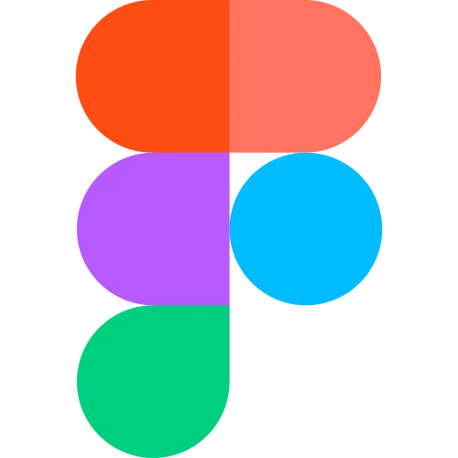
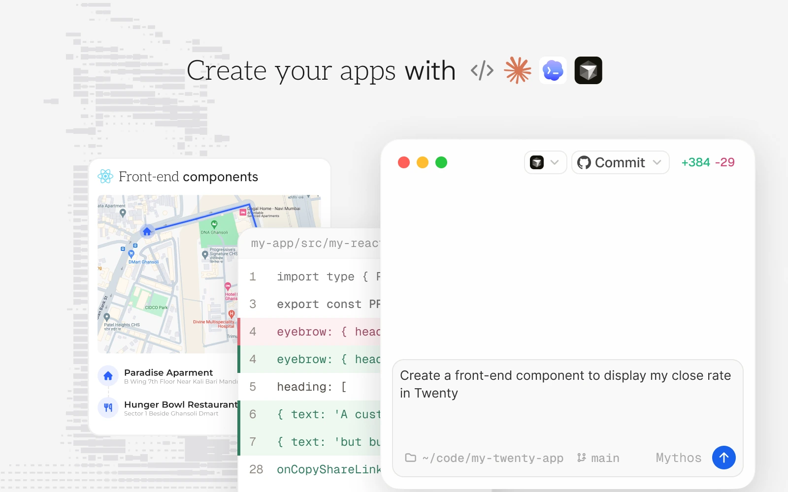
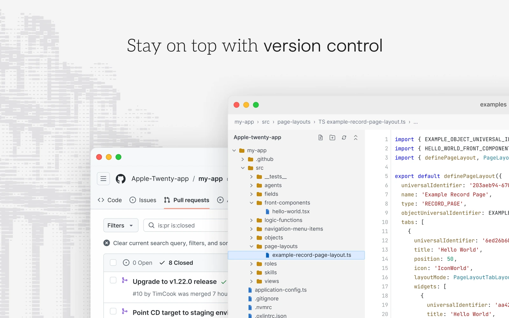
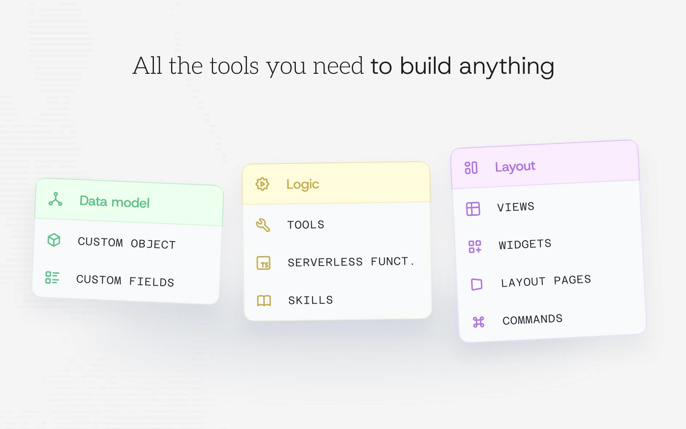
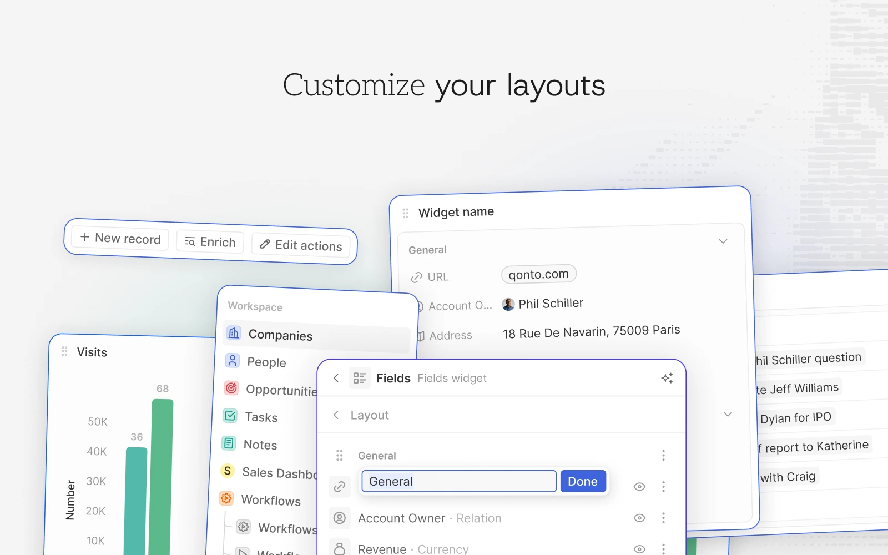

# A2E Suite

**A modular workspace for notes, projects, collaboration and finance — built
on Twenty's native platform.**

A2E Suite is a Twenty fork evolving beyond CRM. Keep the familiar sidebar,
records, views, permissions and workflows; activate only the experiences you
need. **Bureau** is the intended work/knowledge experience. **Bilan** is the
finance app (`a2e-accounting`). Existing CRM journeys remain part of the suite.

> **Development status:** Documents, Projects and Bilan have source code, but
> complete installation, starter-template and collaboration journeys still have
> gaps. Bureau has no separate installable app definition yet. Source presence
> and historical roadmap checkmarks are not release certification.

## Start here

| Goal | Guide |
| --- | --- |
| Understand the fork | [Documentation home](docs/README.md) |
| Find or install Bilan / Bureau | [Applications and troubleshooting](docs/applications.md) |
| Understand the intended experience | [Product, templates and file lifecycle](docs/product-experience.md) |
| Pick development work | [Delivery plan](PLAN.md) and [architecture audit](docs/repository-architecture-audit.md) |
| Contribute or run checks | [Agent guide](AGENTS.md), [codebase map](docs/plan/01-codebase-map.md), [verification](docs/verification.md) |
| Self-host | [Deployment guide](DEPLOY.md); app provisioning is a separate step |

## Twenty foundations and upstream resources

The links and screenshots below describe the upstream platform, not a hosted
A2E Suite service or proof that every planned A2E app is available. Package names
remain `twenty-*` for compatibility; inspiration apps are not runtime services.

<p align="center"><a href="https://twenty.com"> Website</a> · <a href="https://docs.twenty.com"> Documentation</a> · <a href="https://github.com/orgs/twentyhq/projects/1"> Roadmap </a> · <a href="https://discord.gg/cx5n4Jzs57"> Discord</a> · <a href="https://www.figma.com/file/xt8O9mFeLl46C5InWwoMrN/Twenty">  Figma</a></p>

<p align="center">
  <a href="https://www.twenty.com">
    <picture>
      <source media="(prefers-color-scheme: dark)" srcset="./packages/twenty-website/public/images/readme/github-cover-dark.webp" />
      <source media="(prefers-color-scheme: light)" srcset="./packages/twenty-website/public/images/readme/github-cover-light.webp" />
      
    </picture>
  </a>
</p>

<br />

## Why build on Twenty?

Twenty supplies the metadata engine, app SDK, CRM records and shared UI that
let A2E Suite grow without adding another identity, database or navigation
system. The [fork's product contract](docs/product-experience.md) explains what
we reuse and what remains to be delivered.

[Read the upstream Twenty rationale](https://twenty.com/resources/why-twenty).

<br />

# Installation

###  Cloud

[Twenty Cloud](https://twenty.com) is the upstream hosted service, not this
fork's deployment. For A2E Suite use the [deployment guide](DEPLOY.md) and verify
app provisioning with the [applications runbook](docs/applications.md).

###  Build an app

Scaffold a new app with the A2E Suite CLI:

```bash
npx create-twenty-app my-app
```

Use the generated app's pinned SDK and stable universal identifiers. See the
[internal app authoring guide](packages/twenty-apps/README-A2E.md) for native
objects, views, layouts, roles and commands. Do not copy existing app IDs.

Build, publish and install are separate steps, run in an app directory or with
an explicit app path. Follow the [applications runbook](docs/applications.md)
against a confirmed scratch remote; it explains current SDK-version and
packaging limitations.

###  Self-hosting

Run A2E Suite on your own infrastructure with [Docker Compose](https://docs.twenty.com/developers/self-host/capabilities/docker-compose), or contribute locally via the [local setup guide](https://docs.twenty.com/developers/contribute/capabilities/local-setup).

<br />
<br />

# Everything you need

A2E Suite gives you the building blocks of a modern CRM (objects, views, workflows, and agents) and lets you extend them as code. Here's a tour of what's in the box.

Want to go deeper? Read the <a href="https://docs.twenty.com/user-guide/introduction"> User Guide</a> for product walkthroughs, or the <a href="https://docs.twenty.com"> Documentation</a> for developer reference.

<table align="center">
  <tr>
    <td width="50%">
      <picture>
        <source media="(prefers-color-scheme: dark)" srcset="./packages/twenty-website/public/images/readme/v2-build-apps-dark.webp" />
        <source media="(prefers-color-scheme: light)" srcset="./packages/twenty-website/public/images/readme/v2-build-apps-light.webp" />
        
      </picture>
      <p align="center"><a href="https://docs.twenty.com/developers/extend/apps/getting-started"> Learn more about apps in doc</a></p>
    </td>
    <td width="50%">
      <picture>
        <source media="(prefers-color-scheme: dark)" srcset="./packages/twenty-website/public/images/readme/v2-version-control-dark.webp" />
        <source media="(prefers-color-scheme: light)" srcset="./packages/twenty-website/public/images/readme/v2-version-control-light.webp" />
        
      </picture>
      <p align="center"><a href="https://docs.twenty.com/developers/extend/apps/publishing"> Learn more about version control in doc</a></p>
    </td>
  </tr>
  <tr>
    <td width="50%">
      <picture>
        <source media="(prefers-color-scheme: dark)" srcset="./packages/twenty-website/public/images/readme/v2-all-tools-dark.webp" />
        <source media="(prefers-color-scheme: light)" srcset="./packages/twenty-website/public/images/readme/v2-all-tools-light.webp" />
        
      </picture>
      <p align="center"><a href="https://docs.twenty.com/developers/extend/apps/building"> Learn more about primitives in doc</a></p>
    </td>
    <td width="50%">
      <picture>
        <source media="(prefers-color-scheme: dark)" srcset="./packages/twenty-website/public/images/readme/v2-tools-dark.webp" />
        <source media="(prefers-color-scheme: light)" srcset="./packages/twenty-website/public/images/readme/v2-tools-light.webp" />
        
      </picture>
      <p align="center"><a href="https://docs.twenty.com/user-guide/layout/overview"> Learn more about layouts in doc</a></p>
    </td>
  </tr>
  <tr>
    <td width="50%">
      <picture>
        <source media="(prefers-color-scheme: dark)" srcset="./packages/twenty-website/public/images/readme/v2-ai-agents-dark.webp" />
        <source media="(prefers-color-scheme: light)" srcset="./packages/twenty-website/public/images/readme/v2-ai-agents-light.webp" />
        
      </picture>
      <p align="center"><a href="https://docs.twenty.com/user-guide/ai/overview"> Learn more about AI in doc</a></p>
    </td>
    <td width="50%">
      <picture>
        <source media="(prefers-color-scheme: dark)" srcset="./packages/twenty-website/public/images/readme/v2-crm-tools-dark.webp" />
        <source media="(prefers-color-scheme: light)" srcset="./packages/twenty-website/public/images/readme/v2-crm-tools-light.webp" />
        
      </picture>
      <p align="center"><a href="https://docs.twenty.com/user-guide/introduction"> Learn more about CRM features in doc</a></p>
    </td>
  </tr>
</table>

<br />

# Stack

- <a href="https://www.typescriptlang.org/"> TypeScript</a>
- <a href="https://nx.dev/"> Nx</a>
- <a href="https://nestjs.com/"> NestJS</a>, with <a href="https://bullmq.io/">BullMQ</a>, <a href="https://www.postgresql.org/"> PostgreSQL</a>, <a href="https://redis.io/"> Redis</a>
- <a href="https://reactjs.org/"> React</a>, with <a href="https://jotai.org/">Jotai</a>, <a href="https://linaria.dev/">Linaria</a> and <a href="https://lingui.dev/">Lingui</a>

# Thanks

<p align="center">
  <a href="https://greptile.com"></a>
  &nbsp;&nbsp;&nbsp;&nbsp;
  <a href="https://sentry.io/"></a>
  &nbsp;&nbsp;&nbsp;&nbsp;
  <a href="https://crowdin.com/"></a>
</p>

Thanks to these amazing services that we use and recommend for code review (Greptile), catching bugs (Sentry) and translating (Crowdin).

# Join the Community

<p><a href="https://github.com/twentyhq/twenty"> Star the repo</a> · <a href="https://discord.gg/cx5n4Jzs57"> Discord</a> · <a href="https://github.com/twentyhq/twenty/discussions"> Feature requests</a> · <a href="https://github.com/orgs/twentyhq/projects/1/views/35"> Releases</a> · <a href="https://twitter.com/twentycrm"> X</a> · <a href="https://www.linkedin.com/company/twenty/"> LinkedIn</a> · <a href="https://twenty.crowdin.com/twenty"> Crowdin</a> · <a href="https://github.com/twentyhq/twenty/contribute"> Contribute</a></p>
